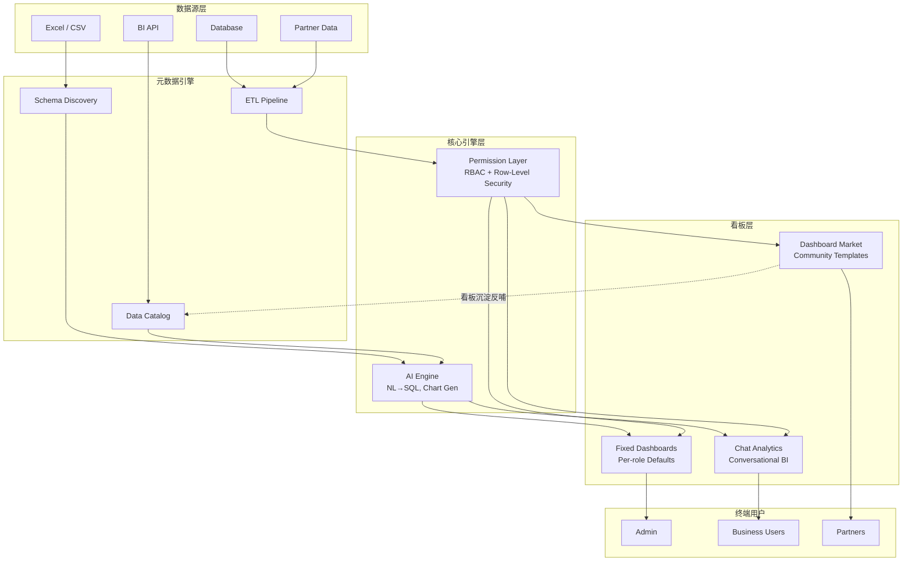
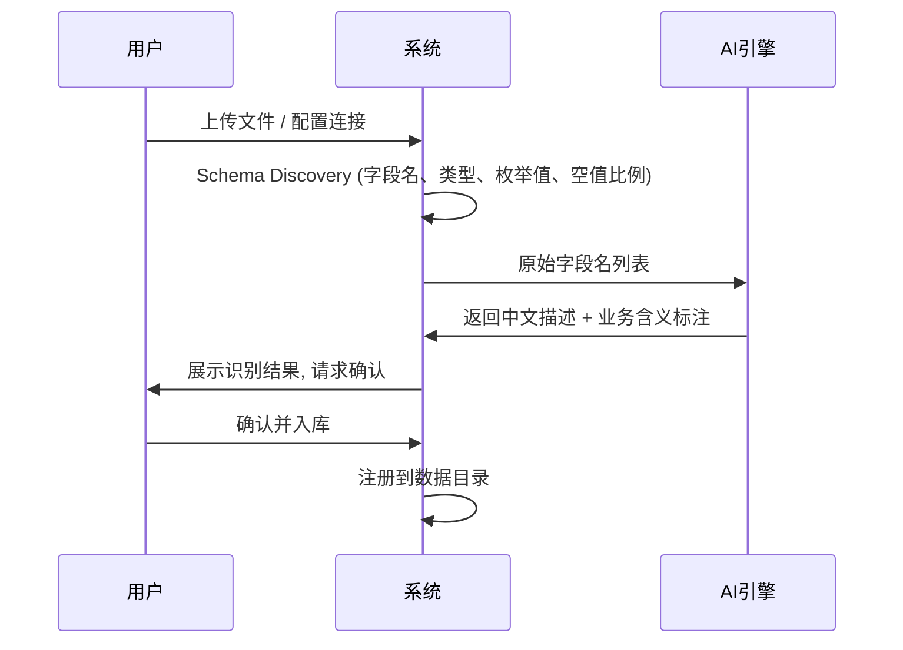
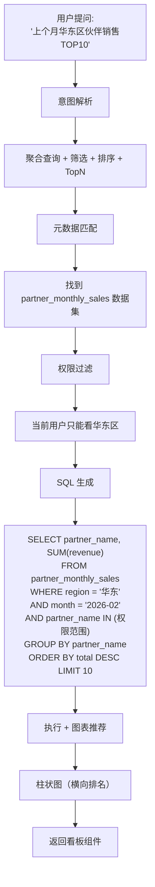
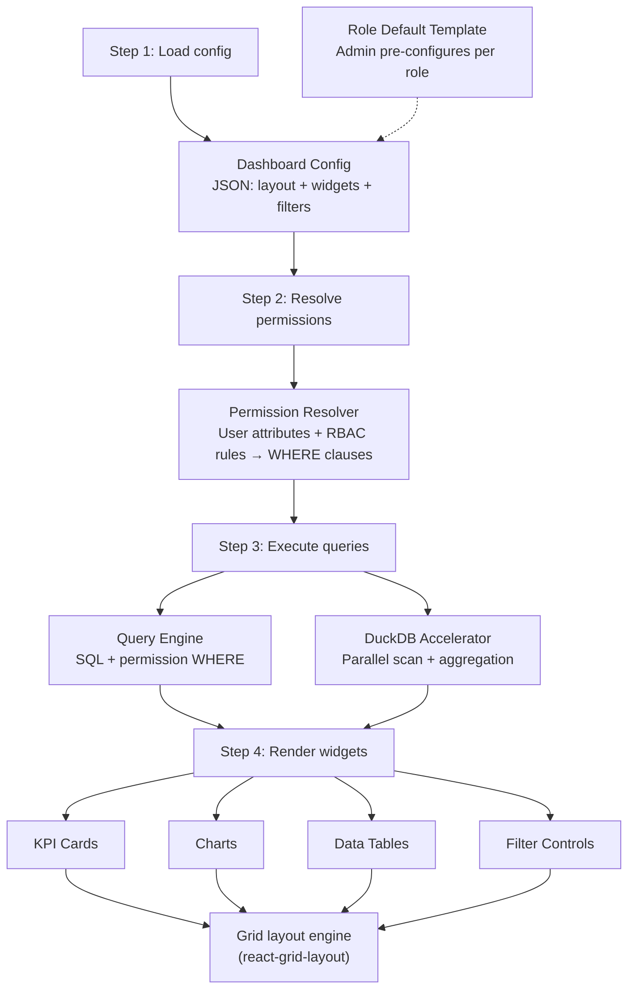
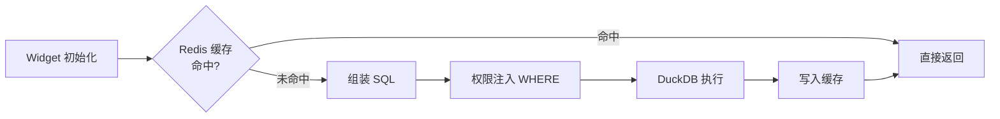
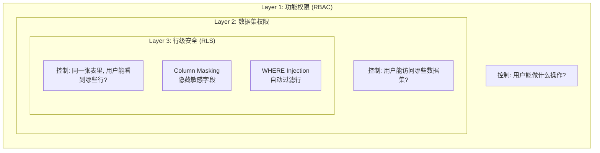
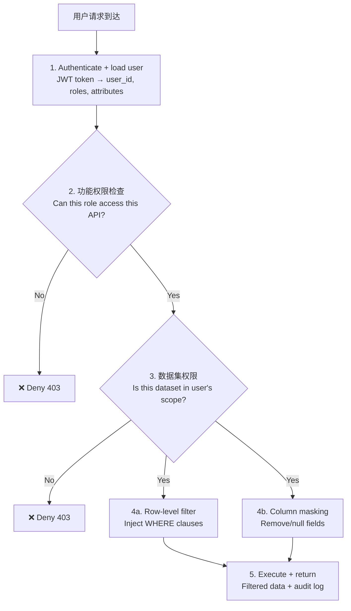
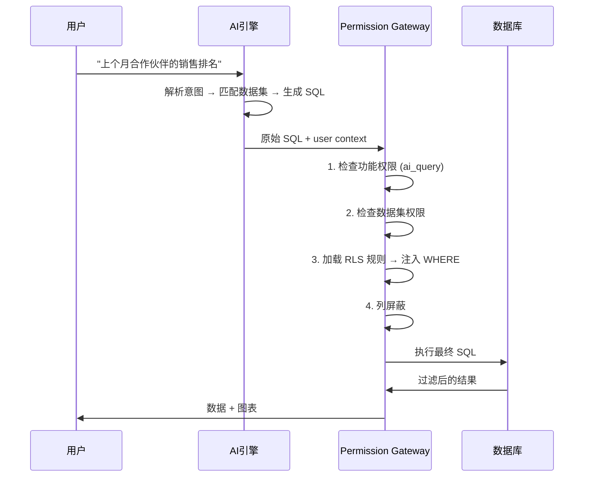
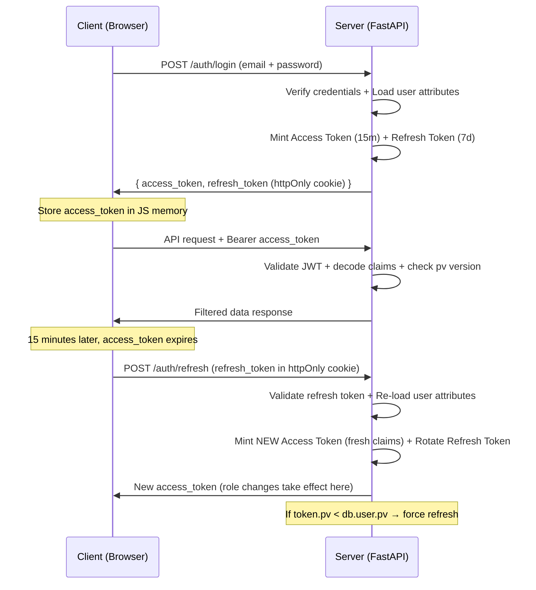
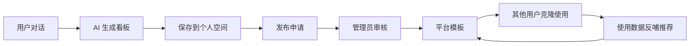

# MetadataHub — AI 驱动的元数据中心 · 完整知识库

> 版本: v0.1 · 最后更新: 2026-03-21
> 状态: 技术方案设计阶段

---

# 第一部分：项目总览

## 1.1 项目定位

MetadataHub 是一个 **AI 驱动的轻量级数据分析平台**，核心理念是"数据进来，看板出去"。用户无需掌握 SQL 或 BI 工具，通过对话即可生成专业级数据看板，同时个人创建的看板可沉淀为平台公共模板，形成社区飞轮。

**目标用户**：中小企业业务团队、合作伙伴运营人员、数据分析师。

**差异化优势**：

- 对话式 BI：用自然语言提问，AI 自动生成 SQL + 可视化
- 看板沉淀机制：个人看板 → 审核 → 平台模板，越用越强
- 行级数据权限：同一看板，不同角色看到不同范围的数据
- 开源 + 可私有化部署

---

## 1.2 整体架构



---

## 1.3 技术选型

| 层级 | 选型 | 理由 |
|------|------|------|
| 前端 | React + TypeScript + Ant Design / shadcn/ui | 生态成熟，组件丰富 |
| 图表引擎 | ECharts / Apache Superset (嵌入) | 灵活 + 可内嵌 |
| 后端 | Python (FastAPI) | AI 生态最好，异步高性能 |
| AI 引擎 | Claude API (Sonnet/Opus) | NL2SQL + 图表配置生成 |
| 数据库 | PostgreSQL + DuckDB | PG 做主库，DuckDB 做分析加速 |
| 元数据存储 | PostgreSQL (JSON schema) | 表结构、字段描述、血缘关系 |
| 权限 | Casbin (RBAC + ABAC) | 灵活的策略引擎 |
| 缓存 | Redis | 查询缓存 + 会话管理 |
| 部署 | Docker Compose / K8s | 开源友好，一键部署 |

---

## 1.4 核心模块结构

```
┌─────────────────────────────────────────────────┐
│                   Frontend (React)               │
│  ┌──────────┐ ┌───────────┐ ┌────────────────┐  │
│  │ 综合看板  │ │ 对话分析   │ │ 看板市场/模板  │  │
│  └──────────┘ └───────────┘ └────────────────┘  │
├─────────────────────────────────────────────────┤
│                  API Gateway (FastAPI)            │
├──────────┬──────────┬───────────┬───────────────┤
│ 数据接入  │ 元数据引擎 │  AI 引擎   │  权限引擎     │
├──────────┴──────────┴───────────┴───────────────┤
│           Storage (PG + DuckDB + Redis)          │
└─────────────────────────────────────────────────┘
```

---

## 1.5 仓库结构

```
metadatahub/
├── apps/
│   ├── web/              # React 前端
│   ├── server/           # FastAPI 后端
│   └── worker/           # 异步任务（数据导入、AI调用）
├── packages/
│   ├── core/             # 元数据引擎核心
│   ├── ai-engine/        # AI NL2SQL + 图表推荐
│   ├── permission/       # 权限引擎
│   └── chart-renderer/   # 图表渲染组件
├── docker/
│   ├── docker-compose.yml
│   └── Dockerfile.*
├── docs/                 # 文档站
├── examples/             # 示例数据 + 配置
└── README.md
```

**开源许可**：Apache 2.0（商业友好，允许基于此做商业化增值）

---

# 第二部分：数据接入与元数据引擎

## 2.1 支持的数据源（按优先级）

- **P0**：Excel/CSV 文件上传（拖拽上传，自动解析表头和数据类型）
- **P0**：手动建表（在线表格编辑器）
- **P1**：BI 平台 API（Power BI、Tableau、帆软 等）
- **P1**：数据库直连（MySQL、PostgreSQL、SQL Server）
- **P2**：SaaS API（飞书/钉钉多维表格、企业微信等）
- **P2**：合作伙伴数据推送接口

## 2.2 接入流程



## 2.3 元数据模型

```json
{
  "dataset_id": "ds_001",
  "name": "合作伙伴月度销售",
  "source_type": "excel",
  "schema": {
    "fields": [
      {
        "name": "partner_name",
        "type": "string",
        "description": "合作伙伴名称",
        "is_dimension": true,
        "permission_tag": "partner_scope"
      },
      {
        "name": "revenue",
        "type": "decimal",
        "description": "月度营收（万元）",
        "is_measure": true,
        "aggregation": "sum"
      }
    ]
  },
  "row_count": 15000,
  "last_updated": "2026-03-18T10:00:00Z"
}
```

## 2.4 元数据引擎功能

- **数据目录**：所有已接入数据集的统一视图，支持搜索、标签、分类
- **Schema 管理**：字段描述、数据类型、业务含义、枚举值字典
- **数据血缘**：记录数据从哪来、被哪些看板使用
- **数据质量监控**：空值率、更新频率、异常值检测
- **AI 增强**：自动识别字段间关联（如 "user_id" 和 "创建人" 是同一概念）

---

# 第三部分：AI 引擎

## 3.1 能力矩阵

| 能力 | 输入 | 输出 | 实现方式 |
|------|------|------|----------|
| NL2SQL | 自然语言问题 + 元数据 | SQL 查询语句 | Claude API + 元数据 Context |
| 图表推荐 | 查询结果 + 问题意图 | ECharts 配置 JSON | Claude 生成 + 规则引擎校验 |
| 看板编排 | 用户描述 + 数据集列表 | 多图表布局 JSON | Claude 多轮对话 |
| 数据洞察 | 查询结果集 | 文字摘要 + 异常标注 | Claude 分析 |
| Schema 标注 | 原始字段名 | 中文描述 + 类型推断 | Claude 批量处理 |

## 3.2 NL2SQL 关键流程



## 3.3 Prompt 工程核心策略

- System Prompt 注入完整的数据目录元数据（表名、字段、类型、描述）
- 使用 Few-shot 示例覆盖常见查询模式
- 生成 SQL 后先做语法校验 + 执行计划分析，再实际执行
- 结果集过大时自动分页或降采样

---

# 第四部分：固定看板系统

## 4.1 设计目标

- **开箱即用**：用户不需要任何配置即可看到有价值的数据
- **千人千面**：同一套看板模板，不同角色看到不同范围的数据
- **可微调**：用户可在管理员预设的框架内调整布局和偏好
- **高性能**：首屏加载 < 2 秒，支持数据预计算和缓存

## 4.2 看板渲染流水线



## 4.3 看板配置 JSON Schema

```json
{
  "dashboard_id": "db_east_china_rm",
  "name": "华东区域经理看板",
  "role_binding": ["regional_manager"],
  "region_binding": ["east_china"],
  "version": 3,
  "layout": {
    "columns": 12,
    "row_height": 80,
    "breakpoints": { "lg": 1200, "md": 996, "sm": 768 }
  },
  "global_filters": [
    {
      "id": "f_period",
      "type": "date_range",
      "label": "时间范围",
      "default": "current_quarter",
      "options": ["current_month", "current_quarter", "ytd", "custom"]
    },
    {
      "id": "f_partner_tier",
      "type": "multi_select",
      "label": "伙伴等级",
      "dataset": "partners",
      "field": "tier",
      "default": ["gold", "silver", "bronze"]
    }
  ],
  "widgets": [
    {
      "id": "w_active_partners",
      "type": "kpi_card",
      "title": "活跃伙伴数",
      "position": { "x": 0, "y": 0, "w": 3, "h": 1 },
      "data_source": {
        "dataset": "partners",
        "query_template": "SELECT COUNT(DISTINCT partner_id) as value FROM partners WHERE status = 'active' AND {period_filter}",
        "comparison": {
          "type": "period_over_period",
          "format": "+{diff} vs last quarter"
        }
      },
      "style": { "value_format": "integer", "trend_color": "auto" },
      "permissions": { "inherit_global": true },
      "user_editable": false
    },
    {
      "id": "w_revenue_trend",
      "type": "line_chart",
      "title": "月度营收趋势",
      "position": { "x": 0, "y": 1, "w": 8, "h": 3 },
      "data_source": {
        "dataset": "partner_monthly_sales",
        "query_template": "SELECT month, SUM(revenue) as revenue FROM partner_monthly_sales WHERE {period_filter} GROUP BY month ORDER BY month",
        "series": [
          { "name": "本年", "field": "revenue", "color": "#378ADD" },
          { "name": "去年", "field": "revenue_ly", "color": "#B4B2A9", "dash": true }
        ]
      },
      "interactions": {
        "drilldown": { "enabled": true, "target_field": "month", "action": "filter_dashboard" },
        "tooltip": true
      },
      "user_editable": true,
      "editable_properties": ["chart_type", "series_visibility"]
    },
    {
      "id": "w_partner_ranking",
      "type": "data_table",
      "title": "伙伴排名",
      "position": { "x": 0, "y": 4, "w": 12, "h": 3 },
      "data_source": {
        "dataset": "partner_quarterly_summary",
        "query_template": "SELECT partner_name, tier, revenue, qoq_change, health_status FROM partner_quarterly_summary WHERE {period_filter} ORDER BY revenue DESC LIMIT 20",
        "columns": [
          { "field": "partner_name", "label": "伙伴名称", "width": "30%" },
          { "field": "tier", "label": "等级", "render": "badge" },
          { "field": "revenue", "label": "营收", "format": "currency_wan", "align": "right" },
          { "field": "qoq_change", "label": "环比", "format": "percentage", "render": "trend_color" },
          { "field": "health_status", "label": "状态", "render": "status_dot" }
        ]
      },
      "interactions": {
        "sort": true,
        "row_click": { "action": "navigate", "target": "/partner/{partner_id}" }
      },
      "user_editable": true,
      "editable_properties": ["visible_columns", "sort_order", "page_size"]
    }
  ]
}
```

## 4.4 Widget 组件类型

| 类型 | 用途 | 配置要点 |
|------|------|----------|
| `kpi_card` | 单个核心指标 | value_format, comparison, threshold |
| `line_chart` | 趋势对比 | series[], x_axis, y_axis, legend |
| `bar_chart` | 排名/分布 | orientation, stacked, category_axis |
| `pie_chart` | 占比分析 | label_field, value_field, max_slices |
| `data_table` | 明细数据 | columns[], sort, pagination, row_click |
| `gauge` | 完成度/达标率 | min, max, thresholds[], current_value |
| `heatmap` | 矩阵分析 | x_field, y_field, value_field, color_scale |
| `filter_bar` | 全局筛选器 | 绑定到 global_filters |

## 4.5 配置层级与合并策略

```
平台默认配置 (由管理员维护)
  └── 角色默认配置 (每个角色一套)
        └── 用户个人配置 (用户微调后的版本)
```

**合并策略**：用户个人配置 > 角色默认配置 > 平台默认配置。
用户只能修改标记为 `user_editable: true` 的组件的 `editable_properties`。
管理员可以一键"重置所有用户到角色默认"。

## 4.6 组件通信机制 (Event Bus)

```typescript
// 筛选器变更 → 所有组件重新查询
interface FilterChangeEvent {
  type: 'FILTER_CHANGE';
  filter_id: string;
  value: any;
}

// 图表点击 → 下钻到明细
interface DrilldownEvent {
  type: 'DRILLDOWN';
  source_widget: string;
  dimension: string;
  value: any;
}

// 组件加载状态
interface WidgetLoadEvent {
  type: 'WIDGET_LOADED' | 'WIDGET_ERROR';
  widget_id: string;
  duration_ms?: number;
  error?: string;
}
```

**联动规则**：
- 全局筛选器变更 → 广播 FILTER_CHANGE → 所有订阅该筛选器的 widget 重新查询
- 图表元素被点击且配置了 drilldown → 广播 DRILLDOWN → 目标 widget 接收并追加筛选条件
- 错误隔离：单个 widget 查询失败不影响其他组件

## 4.7 数据查询与缓存

### 查询流程



### 缓存策略

| 数据类型 | 缓存时间 | 失效策略 |
|----------|----------|----------|
| KPI 指标 | 5 分钟 | 定时刷新 |
| 趋势图 | 15 分钟 | 数据更新时失效 |
| 排名表 | 10 分钟 | 筛选器变更时失效 |
| 实时数据 | 不缓存 | — |

**缓存 key 设计**：
```
dashboard:{dashboard_id}:widget:{widget_id}:user:{user_id}:filters:{filter_hash}
```

### 并发查询优化

- **并行执行**：所有 widget 的查询同时发出（asyncio.gather）
- **查询合并**：如果多个 widget 查询同一张表且 WHERE 条件相同，合并为一次查询
- **预聚合表**：高频看板的核心指标在数据导入时预计算
- **流式返回**：先渲染 KPI 卡片（最快），再渲染图表（稍慢），最后渲染表格（最慢）

## 4.8 角色默认看板模板

| 角色 | 模板名称 | 核心 Widgets |
|------|----------|-------------|
| VP/总监 | 全局健康度 | 总营收、伙伴总数、区域对比地图、TOP10排名、预警列表 |
| 区域经理 | 区域运营 | 区域营收、活跃伙伴、月度趋势、伙伴排名、掉量预警 |
| 渠道专员 | 伙伴明细 | 对口伙伴KPI、逐月趋势、产品线拆分、活跃度指标 |
| 合作伙伴 | 自助看板 | 我的业绩、月度趋势、产品线占比、认证进度 |

## 4.9 前端组件架构

```
<DashboardProvider>           // Context: config + filters + permissions
  <FilterBar />               // 全局筛选器
  <GridLayout>                // react-grid-layout
    <WidgetWrapper>           // 通用壳：标题、加载态、错误态、操作菜单
      <KpiCard />             // 具体组件
    </WidgetWrapper>
    <WidgetWrapper>
      <LineChart />
    </WidgetWrapper>
    <WidgetWrapper>
      <DataTable />
    </WidgetWrapper>
  </GridLayout>
</DashboardProvider>
```

## 4.10 核心 API

```typescript
// 获取用户的固定看板配置（已合并角色默认 + 个人定制）
GET /api/dashboard/fixed
Response: DashboardConfig

// 获取单个 widget 的数据（已注入权限）
POST /api/dashboard/widget/{widget_id}/query
Body: { filters: { period: "2026-Q1", tier: ["gold"] } }
Response: { data: [...], meta: { total_rows, query_time_ms } }

// 保存用户的个人定制
PATCH /api/dashboard/fixed/customize
Body: { layout_changes: [...], widget_overrides: [...] }

// 管理员：创建/更新角色默认模板
PUT /api/admin/dashboard/template/{role_id}
Body: DashboardConfig
```

## 4.11 看板相关数据库表

```sql
-- 看板模板（管理员配置）
CREATE TABLE dashboard_templates (
  id UUID PRIMARY KEY,
  name VARCHAR(100) NOT NULL,
  role_id VARCHAR(50) NOT NULL,
  config JSONB NOT NULL,
  version INT DEFAULT 1,
  is_active BOOLEAN DEFAULT true,
  created_by UUID REFERENCES users(id),
  created_at TIMESTAMPTZ DEFAULT now(),
  updated_at TIMESTAMPTZ DEFAULT now()
);

-- 用户个人定制
CREATE TABLE user_dashboard_overrides (
  id UUID PRIMARY KEY,
  user_id UUID REFERENCES users(id),
  template_id UUID REFERENCES dashboard_templates(id),
  template_version INT NOT NULL,
  layout_overrides JSONB,
  widget_overrides JSONB,
  created_at TIMESTAMPTZ DEFAULT now(),
  updated_at TIMESTAMPTZ DEFAULT now(),
  UNIQUE(user_id, template_id)
);

-- Widget 查询缓存记录
CREATE TABLE widget_query_logs (
  id BIGSERIAL PRIMARY KEY,
  widget_id VARCHAR(50) NOT NULL,
  user_id UUID REFERENCES users(id),
  query_hash VARCHAR(64) NOT NULL,
  query_time_ms INT NOT NULL,
  row_count INT,
  cache_hit BOOLEAN DEFAULT false,
  created_at TIMESTAMPTZ DEFAULT now()
);
```

---

# 第五部分：数据权限与 RBAC 系统

## 5.1 三层权限模型



## 5.2 Layer 1: 功能权限 (RBAC)

### 角色定义

```python
class SystemRole(Enum):
    SUPER_ADMIN = "super_admin"     # 平台超级管理员
    ADMIN = "admin"                 # 组织管理员
    ANALYST = "analyst"             # 数据分析师
    VIEWER = "viewer"               # 只读用户
    PARTNER = "partner"             # 合作伙伴
```

### 权限矩阵

| 权限项 | super_admin | admin | analyst | viewer | partner |
|--------|:-----------:|:-----:|:-------:|:------:|:-------:|
| 管理用户/角色 | ✅ | ✅ | - | - | - |
| 管理数据源 | ✅ | ✅ | ✅ | - | - |
| 创建看板模板 | ✅ | ✅ | ✅ | - | - |
| 配置权限规则 | ✅ | ✅ | - | - | - |
| AI 对话查询 | ✅ | ✅ | ✅ | ✅ | ✅ |
| 查看固定看板 | ✅ | ✅ | ✅ | ✅ | ✅ |
| 保存个人看板 | ✅ | ✅ | ✅ | ✅ | - |
| 发布看板到市场 | ✅ | ✅ | ✅ | - | - |
| 导出数据 | ✅ | ✅ | ✅ | - | - |
| 查看审计日志 | ✅ | ✅ | - | - | - |

### 权限检查中间件

```python
PERMISSION_MAP = {
    "manage_users":      ["super_admin", "admin"],
    "manage_datasources":["super_admin", "admin", "analyst"],
    "create_dashboard":  ["super_admin", "admin", "analyst"],
    "configure_permissions": ["super_admin", "admin"],
    "ai_query":          ["super_admin", "admin", "analyst", "viewer", "partner"],
    "view_dashboard":    ["super_admin", "admin", "analyst", "viewer", "partner"],
    "save_dashboard":    ["super_admin", "admin", "analyst", "viewer"],
    "publish_dashboard": ["super_admin", "admin", "analyst"],
    "export_data":       ["super_admin", "admin", "analyst"],
    "view_audit_log":    ["super_admin", "admin"],
}

def require_permission(permission: str):
    def decorator(func):
        @wraps(func)
        async def wrapper(*args, current_user=Depends(get_current_user), **kwargs):
            allowed_roles = PERMISSION_MAP.get(permission, [])
            if current_user.role not in allowed_roles:
                raise HTTPException(status_code=403,
                    detail=f"Role '{current_user.role}' lacks permission '{permission}'")
            return await func(*args, current_user=current_user, **kwargs)
        return wrapper
    return decorator
```

## 5.3 Layer 2: 数据集权限 (ACL)

```python
class DatasetAccess:
    dataset_id: str          # 数据集 ID
    grantee_type: str        # "role" | "user" | "group"
    grantee_id: str          # 角色名 / 用户ID / 组ID
    access_level: str        # "read" | "write" | "admin"
```

### 典型配置示例

```yaml
# 合作伙伴月度销售表 — 大多数角色可读
dataset: partner_monthly_sales
access:
  - { grantee_type: role, grantee_id: admin,   access_level: admin }
  - { grantee_type: role, grantee_id: analyst, access_level: read }
  - { grantee_type: role, grantee_id: viewer,  access_level: read }
  - { grantee_type: role, grantee_id: partner, access_level: read }

# 内部财务数据表 — partner 角色完全不可见
dataset: internal_financials
access:
  - { grantee_type: role,  grantee_id: admin,        access_level: admin }
  - { grantee_type: group, grantee_id: finance_team,  access_level: read }
```

### 检查逻辑

```python
async def check_dataset_access(user: User, dataset_id: str) -> bool:
    # 1. 超级管理员放行
    if user.role == "super_admin": return True
    # 2. 检查角色级别授权
    # 3. 检查用户级别授权
    # 4. 检查组级别授权
    # 任一匹配即放行，全部不匹配则拒绝
```

## 5.4 Layer 3: 行级安全 (RLS)

### RLS 规则模型

```python
class RLSRule:
    id: str
    dataset_id: str              # 绑定的数据集
    name: str                    # 规则名称
    priority: int                # 优先级
    condition_type: str          # 条件类型 (见下表)
    field: str                   # 数据集中的字段名
    operator: str                # "eq" | "in" | "between" | "custom_sql"
    value_source: str            # 值的来源
    applies_to_roles: list[str]  # 适用的角色列表
    exempt_roles: list[str]      # 豁免角色
    is_active: bool
```

### 五种条件类型

| 类型 | 说明 | 示例 | 生成的 WHERE |
|------|------|------|-------------|
| `attribute_match` | 用户属性直接匹配 | 区域经理只看自己区域 | `WHERE region = '{user.region}'` |
| `relation_lookup` | 通过关联表查找 | 渠道专员看对口伙伴 | `WHERE partner_id IN (SELECT ...)` |
| `self_match` | 自身匹配 | 伙伴只看自己 | `WHERE partner_id = '{user.partner_id}'` |
| `hierarchy` | 组织层级继承 | VP 看全部下级区域 | `WHERE region IN (SELECT ... FROM org_hierarchy)` |
| `time_window` | 时间窗口 | 免费用户只看近3月 | `WHERE created_at BETWEEN ...` |

### 条件类型配置示例

```yaml
# Type 1: attribute_match — 区域经理只看自己负责的区域
- condition_type: attribute_match
  field: region
  operator: eq
  value_source: user.region
  applies_to_roles: [viewer, analyst]
  exempt_roles: [super_admin, admin]
  # → WHERE region = 'East'

# Type 2: relation_lookup — 渠道专员只看对口伙伴
- condition_type: relation_lookup
  field: partner_id
  operator: in
  value_source: >
    SELECT partner_id FROM user_partner_assignments
    WHERE user_id = '{user.id}'
  applies_to_roles: [viewer]
  exempt_roles: [super_admin, admin, analyst]
  # → WHERE partner_id IN (SELECT ...)

# Type 3: self_match — 合作伙伴只看自己
- condition_type: self_match
  field: partner_id
  operator: eq
  value_source: user.partner_id
  applies_to_roles: [partner]
  # → WHERE partner_id = 'p_001'

# Type 4: hierarchy — VP 看自己及下级所有区域
- condition_type: hierarchy
  field: region
  operator: in
  value_source: >
    SELECT region FROM org_hierarchy
    WHERE ancestor_id = '{user.org_node_id}'
  applies_to_roles: [analyst, viewer]
  exempt_roles: [super_admin, admin]

# Type 5: time_window — 免费用户只看最近 3 个月
- condition_type: time_window
  field: created_at
  operator: between
  value_source: "NOW() - INTERVAL '3 months' AND NOW()"
  applies_to_roles: [free_user]
```

## 5.5 Permission Resolver 核心实现

```python
class PermissionResolver:
    async def resolve(self, user: User, dataset_id: str, base_query: str) -> ResolvedQuery:
        # Step 1: 加载该数据集的所有 RLS 规则
        rules = await self._load_rules(dataset_id)
        # Step 2: 过滤出适用于当前用户的规则
        applicable_rules = self._filter_applicable(rules, user)
        # Step 3: 构建 WHERE 条件
        where_clauses = []
        for rule in applicable_rules:
            clause = await self._build_clause(rule, user)
            if clause:
                where_clauses.append(clause)
        # Step 4: 获取列屏蔽规则
        masked_columns = await self._get_masked_columns(dataset_id, user)
        # Step 5: 注入到查询中 (用 CTE 包裹避免 WHERE 冲突)
        final_query = self._inject_where(base_query, where_clauses)
        final_query = self._apply_column_mask(final_query, masked_columns)
        return ResolvedQuery(sql=final_query, masked_columns=masked_columns)

    def _inject_where(self, query: str, clauses: list[str]) -> str:
        """用 CTE 包裹原始查询, 在外层添加 WHERE"""
        if not clauses: return query
        combined = " AND ".join(f"({c})" for c in clauses)
        return f"""
        WITH __base AS ({query})
        SELECT * FROM __base WHERE {combined}
        """
```

## 5.6 权限解析完整流程



## 5.7 列级屏蔽 (Column Masking)

| 屏蔽类型 | 效果 | 示例 |
|----------|------|------|
| `hide` | 完全不返回该列 | 利润率字段不返回给伙伴 |
| `redact` | 替换为 "***" | 联系电话显示为 138****5678 |
| `partial` | 部分脱敏 | 邮箱显示为 z**@example.com |
| `hash` | 替换为哈希值 | 可关联但不可读 |

## 5.8 权限效果矩阵（合作伙伴运营场景）

同一条 SQL 查询 `SELECT partner_name, tier, SUM(revenue) FROM partner_quarterly_sales WHERE quarter='2026-Q1' GROUP BY partner_name, tier ORDER BY total DESC`，不同用户看到的结果：

| 用户 | 角色 | 属性 | 权限注入 | 可见行 | 隐藏列 |
|------|------|------|----------|--------|--------|
| 张总 | admin | - | 无注入 (exempt) | 全部伙伴, 全部区域 | 无 |
| 李经理 | analyst | region=East | `AND region = 'East'` | 华东区所有伙伴 | 无 |
| 王专员 | viewer | 3 assigned | `AND partner_id IN (...)` | 3 家对口伙伴 | profit_margin |
| InfoTech | partner | partner_id=p_001 | `AND partner_id = 'p_001'` | 仅自身 | profit_margin |

## 5.9 与 AI 查询引擎的集成

### AI 查询权限流程



### AI Prompt 权限感知

```python
def build_ai_context(user: User, datasets: list) -> str:
    """注入到 AI System Prompt, 不泄漏规则细节, 只告知可见范围"""
    return f"""
当前用户角色: {user.role}
数据可见范围: {user.scope_desc}

重要: 你不需要在 SQL 中添加权限过滤条件，系统会自动处理。
请基于用户的可见范围来组织回答的语言。
例如，如果用户只能看华东区数据，不要说"全国销售排名"，而说"华东区销售排名"。
"""
```

### AI 生成 SQL 安全校验

```python
class SQLSafetyChecker:
    FORBIDDEN_PATTERNS = [
        r'\bDROP\b', r'\bDELETE\b', r'\bUPDATE\b', r'\bINSERT\b',
        r'\bALTER\b', r'\bCREATE\b', r'\bTRUNCATE\b',
        r'\bGRANT\b', r'\bREVOKE\b',
        r'\bEXEC\b', r'\bEXECUTE\b',
        r'--', r';', r'\bUNION\b',
    ]

    def check(self, sql: str, allowed_datasets: list[str]) -> SafetyResult:
        # 1. 只允许 SELECT
        # 2. 检查禁止的关键字
        # 3. 检查引用的表名是否在允许列表中
        # 4. 检查查询复杂度（JOIN 数量）
```

## 5.10 权限相关数据库表

```sql
-- RLS 规则
CREATE TABLE rls_rules (
    id UUID PRIMARY KEY,
    dataset_id VARCHAR(100) NOT NULL,
    name VARCHAR(200) NOT NULL,
    description TEXT,
    priority INT DEFAULT 100,
    condition_type VARCHAR(50) NOT NULL,
    field VARCHAR(100) NOT NULL,
    operator VARCHAR(20) NOT NULL,
    value_source TEXT NOT NULL,
    applies_to_roles TEXT[] DEFAULT '{}',
    applies_to_users UUID[] DEFAULT '{}',
    exempt_roles TEXT[] DEFAULT '{}',
    is_active BOOLEAN DEFAULT true,
    created_by UUID REFERENCES users(id),
    created_at TIMESTAMPTZ DEFAULT now(),
    updated_at TIMESTAMPTZ DEFAULT now()
);

-- 列屏蔽
CREATE TABLE column_masks (
    id UUID PRIMARY KEY,
    dataset_id VARCHAR(100) NOT NULL,
    column_name VARCHAR(100) NOT NULL,
    mask_type VARCHAR(20) NOT NULL,
    applies_to_roles TEXT[] DEFAULT '{}',
    exempt_roles TEXT[] DEFAULT '{}',
    is_active BOOLEAN DEFAULT true,
    created_at TIMESTAMPTZ DEFAULT now()
);

-- 审计日志
CREATE TABLE permission_audit_log (
    id BIGSERIAL PRIMARY KEY,
    user_id UUID NOT NULL,
    action VARCHAR(50) NOT NULL,
    dataset_id VARCHAR(100),
    applied_rules UUID[],
    masked_columns TEXT[],
    query_hash VARCHAR(64),
    result_row_count INT,
    ip_address INET,
    user_agent TEXT,
    created_at TIMESTAMPTZ DEFAULT now()
);

CREATE INDEX idx_audit_user ON permission_audit_log(user_id, created_at);
CREATE INDEX idx_audit_dataset ON permission_audit_log(dataset_id, created_at);
```

## 5.11 管理界面结构

```
权限管理
├── 角色管理
│   ├── 角色列表（CRUD）
│   └── 角色-权限矩阵（勾选式）
├── 数据集权限
│   ├── 按数据集查看：谁能访问这张表？
│   └── 按用户查看：这个人能访问哪些表？
├── 行级权限
│   ├── 规则列表（按数据集分组）
│   ├── 规则编辑器（表单式，不需要写SQL）
│   └── 规则测试器（选一个用户，看他的可见数据范围）
├── 列屏蔽
│   ├── 按数据集配置
│   └── 预览效果
└── 审计日志
    ├── 查询日志
    ├── 被拒绝的访问
    └── 按用户/数据集筛选
```

---

# 第六部分：JWT 令牌与认证系统

## 6.1 核心设计决策

Token 里放"属性摘要"（角色、区域、伙伴绑定等），Permission Resolver 拿这些属性匹配 RLS 规则、生成 WHERE 条件。RLS 规则在服务端 Redis 缓存，不放进 token。

| 策略 | 优点 | 缺点 |
|------|------|------|
| 极简 token（只放 user_id） | Token 小，权限变更实时生效 | 每次请求都查库，性能差 |
| 全量 token（放所有权限规则） | 零查库，极快 | Token 巨大，权限变更延迟 |
| **✅ 平衡 token（放属性摘要）** | **够用且不大，15分钟内生效** | **需要 refresh 机制** |

## 6.2 双 Token 架构



### Token 规格

| 属性 | Access Token | Refresh Token |
|------|-------------|---------------|
| 类型 | JWT (签名, 不加密) | 不透明随机字符串 (非 JWT) |
| 存储 | 前端 JS 内存 (非 localStorage) | httpOnly + Secure + SameSite=Strict Cookie |
| 生命 | 15 分钟 | 7 天 (可续期) |
| 传输 | Authorization: Bearer {token} | 自动随 Cookie 发送到 /auth/refresh |
| 服务端 | 无状态验证 (签名校验) | 服务端存储, 支持主动吊销 |

## 6.3 Access Token Payload 完整结构

```python
@dataclass
class AccessTokenPayload:
    # === 标准 JWT Claims ===
    sub: str            # 用户唯一 ID (如 "u_001")
    iat: int            # 签发时间 (Unix timestamp)
    exp: int            # 过期时间 (iat + 900 = 15分钟)
    jti: str            # Token 唯一 ID (防重放)

    # === 用户身份 ===
    name: str           # 用户姓名 (前端展示用)
    email: str          # 邮箱
    role: str           # 系统角色 (admin / analyst / viewer / partner)

    # === 权限属性 (Permission Resolver 的核心输入) ===
    org_node: str | None      # 组织树节点 ID (用于 hierarchy 类型 RLS)
    region: str | None        # 所属区域 (用于 attribute_match 类型 RLS)
    department: str | None    # 所属部门
    partner_id: str | None    # 绑定的合作伙伴 ID (partner 角色必填)

    # === 数据集访问列表 ===
    datasets: list[str]       # 有权访问的数据集 ID 列表 (Layer 2 预计算)

    # === 权限版本号 ===
    pv: int                   # Permission Version, 管理员修改权限时 +1

    # === 作用域描述 (给 AI 用) ===
    scope_desc: str           # 人类可读的权限范围描述
```

### Payload 示例

**区域经理 (Li Fang)**:
```json
{
  "sub": "u_042",
  "iat": 1711000000,
  "exp": 1711000900,
  "jti": "tok_8f3a2b1c",
  "name": "Li Fang",
  "email": "li.fang@company.com",
  "role": "analyst",
  "org_node": "org_east",
  "region": "East",
  "department": "Channel Sales",
  "partner_id": null,
  "datasets": ["partner_monthly_sales", "partner_activities"],
  "pv": 3,
  "scope_desc": "East China region"
}
```

**合作伙伴用户 (Chen Mei)**:
```json
{
  "sub": "u_ext_301",
  "iat": 1711000000,
  "exp": 1711000900,
  "jti": "tok_7e2d4a9f",
  "name": "Chen Mei",
  "email": "chen@infotech.cn",
  "role": "partner",
  "org_node": null,
  "region": null,
  "department": null,
  "partner_id": "p_001",
  "datasets": ["partner_monthly_sales"],
  "pv": 1,
  "scope_desc": "Self only (Shanghai InfoTech)"
}
```

## 6.4 Token 签发流程

```python
async def login(email: str, password: str, db, redis) -> TokenPair:
    # Step 1: 验证凭据
    user = await db.fetch_one("SELECT * FROM users WHERE email = $1", email)
    if not user or not verify_password(password, user.password_hash):
        raise AuthenticationError("Invalid credentials")

    # Step 2: 加载用户完整属性 (包括数据集权限)
    user_context = await load_user_context(user, db)

    # Step 3: 签发 Access Token (JWT)
    access_token = mint_access_token(user_context)

    # Step 4: 签发 Refresh Token (不透明字符串, 存服务端)
    refresh_token = secrets.token_urlsafe(48)
    await db.execute(
        "INSERT INTO refresh_tokens (token_hash, user_id, expires_at, device_info) VALUES ($1, $2, $3, $4)",
        hash_token(refresh_token), user.id,
        datetime.now(timezone.utc) + REFRESH_TTL, get_device_info()
    )

    return TokenPair(access_token=access_token, refresh_token=refresh_token,
                     expires_in=int(ACCESS_TTL.total_seconds()))

async def load_user_context(user, db) -> UserContext:
    """登录 和 refresh 时都调用, 重新加载最新属性"""
    datasets = await db.fetch_all(
        """SELECT DISTINCT da.dataset_id FROM dataset_access da
           LEFT JOIN user_group_members ugm ON ugm.user_id = $1
           WHERE (da.grantee_type = 'role' AND da.grantee_id = $2)
              OR (da.grantee_type = 'user' AND da.grantee_id = $1::text)
              OR (da.grantee_type = 'group' AND da.grantee_id = ugm.group_id::text)""",
        user.id, user.role
    )
    return UserContext(
        sub=str(user.id), name=user.name, email=user.email,
        role=user.role, org_node=user.org_node_id,
        region=user.region, department=user.department,
        partner_id=str(user.partner_id) if user.partner_id else None,
        datasets=[r.dataset_id for r in datasets],
        pv=user.permission_version,
        scope_desc=generate_scope_description(user),
    )
```

## 6.5 Refresh Token 轮转

```python
async def refresh_access_token(refresh_token: str, db) -> TokenPair:
    # Step 1: 验证 Refresh Token
    stored = await db.fetch_one(
        "SELECT * FROM refresh_tokens WHERE token_hash = $1 AND expires_at > NOW() AND is_revoked = false",
        hash_token(refresh_token)
    )
    if not stored:
        raise AuthenticationError("Invalid or expired refresh token")

    # Step 2: Rotation — 旧 token 作废
    await db.execute("UPDATE refresh_tokens SET is_revoked = true WHERE id = $1", stored.id)

    # Step 3: 重新加载用户属性 (权限变更在此生效!)
    user = await db.fetch_one("SELECT * FROM users WHERE id = $1", stored.user_id)
    user_context = await load_user_context(user, db)

    # Step 4: 签发新的 token pair
    new_access = mint_access_token(user_context)
    new_refresh = secrets.token_urlsafe(48)
    await db.execute(
        "INSERT INTO refresh_tokens (token_hash, user_id, expires_at, parent_id) VALUES ($1, $2, $3, $4)",
        hash_token(new_refresh), user.id,
        datetime.now(timezone.utc) + REFRESH_TTL, stored.id
    )
    return TokenPair(access_token=new_access, refresh_token=new_refresh,
                     expires_in=int(ACCESS_TTL.total_seconds()))
```

## 6.6 请求验证中间件

```python
async def get_current_user(credentials = Depends(security), redis = Depends(get_redis)) -> AuthenticatedUser:
    token = credentials.credentials

    # Step 1: 解码并验证签名 + 过期时间
    try:
        payload = jwt.decode(token, SECRET_KEY, algorithms=[ALGORITHM])
    except jwt.ExpiredSignatureError:
        raise HTTPException(status_code=401, detail="Token expired")
    except JWTError:
        raise HTTPException(status_code=401, detail="Invalid token")

    # Step 2: 检查黑名单 (主动吊销场景)
    jti = payload.get("jti")
    if jti and await redis.exists(f"token_blacklist:{jti}"):
        raise HTTPException(status_code=401, detail="Token revoked")

    # Step 3: 检查 Permission Version
    current_pv = await redis.get(f"user_pv:{payload['sub']}")
    if current_pv and int(current_pv) > payload.get("pv", 0):
        raise HTTPException(status_code=401, detail="Permission changed",
                            headers={"X-Permission-Stale": "true"})

    # Step 4: 构造 AuthenticatedUser
    return AuthenticatedUser(
        id=payload["sub"], name=payload["name"], email=payload["email"],
        role=payload["role"], org_node=payload.get("org_node"),
        region=payload.get("region"), department=payload.get("department"),
        partner_id=payload.get("partner_id"),
        datasets=payload.get("datasets", []),
        pv=payload.get("pv", 0), scope_desc=payload.get("scope_desc", ""),
    )
```

## 6.7 Permission Version 机制

解决"管理员改了用户权限, 何时生效"的问题。

```python
async def update_user_role(admin_user, target_user_id, new_role, db, redis):
    # 1. 更新数据库, permission_version +1
    await db.execute(
        "UPDATE users SET role = $1, permission_version = permission_version + 1 WHERE id = $2",
        new_role, target_user_id
    )
    # 2. 更新 Redis (中间件检查这个值)
    new_pv = await db.fetch_val("SELECT permission_version FROM users WHERE id = $1", target_user_id)
    await redis.set(f"user_pv:{target_user_id}", new_pv)
    # 3. (可选) 紧急情况: 直接加入黑名单, 立即失效
    # await blacklist_user_tokens(target_user_id, redis)
```

### 生效时机

| 场景 | 生效延迟 |
|------|----------|
| 正常权限变更 | 最迟 15 分钟 (等 Access Token 自然过期) |
| pv 版本检查 | 下一次 API 请求 (中间件检测到 pv 过时 → 401 → 前端自动 refresh) |
| 紧急吊销 | 立即 (加入 token 黑名单, jti 检查) |

## 6.8 前端 Token 管理器

```typescript
class TokenManager {
  private accessToken: string | null = null;
  private refreshTimer: number | null = null;

  setTokens(accessToken: string, expiresIn: number) {
    this.accessToken = accessToken;
    // 在过期前 60 秒自动刷新
    if (this.refreshTimer) clearTimeout(this.refreshTimer);
    this.refreshTimer = window.setTimeout(
      () => this.silentRefresh(), (expiresIn - 60) * 1000
    );
  }

  getAccessToken(): string | null { return this.accessToken; }

  async silentRefresh() {
    const res = await fetch('/auth/refresh', { method: 'POST', credentials: 'include' });
    if (res.ok) {
      const data = await res.json();
      this.setTokens(data.access_token, data.expires_in);
    } else {
      this.accessToken = null;
      window.location.href = '/login';
    }
  }

  async initFromRefreshToken(): Promise<boolean> {
    try { await this.silentRefresh(); return true; } catch { return false; }
  }

  logout() {
    this.accessToken = null;
    if (this.refreshTimer) clearTimeout(this.refreshTimer);
    fetch('/auth/logout', { method: 'POST', credentials: 'include' });
  }
}

// Axios 拦截器: 遇到 401 + pv 过时, 自动刷新
api.interceptors.response.use(
  response => response,
  async error => {
    if (error.response?.status === 401) {
      const isStale = error.response.headers['x-permission-stale'];
      if (isStale || error.response.data.detail === 'Token expired') {
        const newTokens = await tokenManager.silentRefresh();
        error.config.headers['Authorization'] = `Bearer ${tokenManager.getAccessToken()}`;
        return api(error.config);
      }
      router.push('/login');
    }
    return Promise.reject(error);
  }
);
```

## 6.9 Token 存储安全

```
Access Token:
  存储: JavaScript 内存变量 (不是 localStorage/sessionStorage)
  原因: XSS 攻击无法直接读取内存变量
  代价: 页面刷新后丢失 → 用 refresh token 重新获取

Refresh Token:
  存储: httpOnly + Secure + SameSite=Strict Cookie, Path=/auth/refresh
  原因: httpOnly → JS 不可见 → XSS 无法窃取
        SameSite=Strict → CSRF 无效
        Path=/auth/refresh → 只在刷新时发送
```

## 6.10 Token 相关数据库表

```sql
CREATE TABLE refresh_tokens (
    id UUID PRIMARY KEY DEFAULT gen_random_uuid(),
    token_hash VARCHAR(128) NOT NULL UNIQUE,
    user_id UUID NOT NULL REFERENCES users(id),
    expires_at TIMESTAMPTZ NOT NULL,
    is_revoked BOOLEAN DEFAULT false,
    parent_id UUID REFERENCES refresh_tokens(id),
    device_info JSONB,
    created_at TIMESTAMPTZ DEFAULT now()
);

CREATE INDEX idx_refresh_hash ON refresh_tokens(token_hash) WHERE NOT is_revoked;
CREATE INDEX idx_refresh_user ON refresh_tokens(user_id, created_at);

ALTER TABLE users ADD COLUMN permission_version INT DEFAULT 1;
```

## 6.11 Token → Permission Resolver 衔接

```python
@app.post("/api/dashboard/widget/{widget_id}/query")
@require_permission("view_dashboard")
async def query_widget(widget_id: str, filters: dict,
    current_user: AuthenticatedUser = Depends(get_current_user),
    resolver: PermissionResolver = Depends(get_resolver)):
    """
    完整链路:
    1. get_current_user → JWT 解码 → AuthenticatedUser (role, region, partner_id...)
    2. require_permission → 功能权限检查
    3. 加载 widget 配置 → SQL 模板
    4. Permission Resolver → 用 AuthenticatedUser 属性 + RLS 规则 → 注入 WHERE
    5. 执行过滤后的 SQL → 返回数据
    """
    widget = await get_widget_config(widget_id, db)

    # 数据集权限 (Layer 2)
    if widget.dataset_id not in current_user.datasets:
        raise HTTPException(403, "No access to this dataset")

    # RLS (Layer 3)
    resolved = await resolver.resolve(
        user=current_user,
        dataset_id=widget.dataset_id,
        base_query=widget.build_query(filters),
    )

    result = await db.fetch_all(resolved.sql)
    return {"data": result, "masked_columns": resolved.masked_columns}
```

## 6.12 安全要点清单

| 要点 | 实现方式 |
|------|----------|
| Token 签名验证 | HS256, 密钥 ≥ 256 位 |
| 过期控制 | Access 15 分钟, Refresh 7 天 |
| 权限变更及时生效 | pv 版本号 + 中间件检查 |
| 紧急吊销 | jti 加入 Redis 黑名单 |
| XSS 防护 | Access Token 存内存; Refresh Token httpOnly Cookie |
| CSRF 防护 | SameSite=Strict + Refresh Token 仅限 /auth/refresh |
| Replay 防护 | jti 唯一 ID; Refresh Token Rotation |
| 泄漏检测 | 已吊销 refresh token 被重用 → 吊销该用户全部 token |
| 日志安全 | 不打印 token 明文, 只记录 jti |
| 密钥轮转 | 支持同时验证多个密钥 (kid header) |

---

# 第七部分：用户与组织模型

## 7.1 核心表结构

```sql
CREATE TABLE users (
    id UUID PRIMARY KEY,
    email VARCHAR(255) UNIQUE NOT NULL,
    name VARCHAR(100) NOT NULL,
    password_hash VARCHAR(255) NOT NULL,
    role VARCHAR(50) NOT NULL DEFAULT 'viewer',
    region VARCHAR(50),
    department VARCHAR(100),
    org_node_id UUID,
    manager_id UUID,
    partner_id UUID REFERENCES partners(id),
    attributes JSONB DEFAULT '{}',
    permission_version INT DEFAULT 1,
    is_active BOOLEAN DEFAULT true,
    created_at TIMESTAMPTZ DEFAULT now(),
    updated_at TIMESTAMPTZ DEFAULT now()
);

CREATE TABLE user_partner_assignments (
    user_id UUID REFERENCES users(id),
    partner_id UUID REFERENCES partners(id),
    assigned_at TIMESTAMPTZ DEFAULT now(),
    PRIMARY KEY (user_id, partner_id)
);

CREATE TABLE user_groups (
    id UUID PRIMARY KEY,
    name VARCHAR(100) NOT NULL,
    description TEXT
);

CREATE TABLE user_group_members (
    group_id UUID REFERENCES user_groups(id),
    user_id UUID REFERENCES users(id),
    PRIMARY KEY (group_id, user_id)
);

-- 闭包表实现组织树
CREATE TABLE org_hierarchy (
    ancestor_id UUID NOT NULL,
    descendant_id UUID NOT NULL,
    depth INT NOT NULL,
    PRIMARY KEY (ancestor_id, descendant_id)
);
```

---

# 第八部分：合作伙伴运营场景

## 8.1 数据接入

- 合作伙伴基础信息（名称、等级、区域、负责人）
- 销售数据（月度/季度业绩、产品线拆分）
- 活跃度数据（登录次数、培训参与、认证进度）
- 市场活动数据（联合营销、线索转化）

## 8.2 角色 × 看板矩阵

| 角色 | 综合看板 | 对话分析 | 数据范围 |
|------|----------|----------|----------|
| VP/总监 | 全局伙伴健康度仪表盘 | 任意分析 | 全部 |
| 区域经理 | 所辖区域伙伴排名 + 预警 | 区域内分析 | 所辖区域 |
| 渠道专员 | 负责伙伴的KPI卡片 | 对口伙伴分析 | 对口伙伴 |
| 合作伙伴 | 自己的业绩看板 | 自身数据分析 | 仅自身 |

## 8.3 典型对话示例

```
用户（区域经理）: 我负责的伙伴里，这个季度掉量最多的是哪几家？
AI: [自动过滤到该经理负责的华东区伙伴]
    → 生成 SQL（环比对比 + 排序）
    → 返回柱状图 + 数据表
    → 文字洞察："XXX公司季度环比下降32%，主要是A产品线减少"

用户: 把这个做成一个监控看板，每月自动更新
AI: → 生成看板配置 → 保存 → 设置月度刷新
```

---

# 第九部分：看板沉淀机制

## 9.1 三种看板形态

| 形态 | 说明 | 创建方式 |
|------|------|----------|
| 综合看板（固定看板） | 角色默认首页, 管理员预配置 | 管理员模板编辑器 |
| 对话看板（AI 生成） | 通过对话入口按需生成 | 用户自然语言提问 |
| 看板市场（沉淀模板） | 用户看板发布为公共模板 | 用户申请 + 管理员审核 |

## 9.2 沉淀闭环



---

# 第十部分：项目路线图

## Phase 1: MVP（6-8 周）

目标：跑通核心闭环 — 数据导入 → AI 查询 → 看板展示

- [ ] 项目脚手架搭建（monorepo, CI/CD）
- [ ] Excel/CSV 上传 + 自动 Schema 发现
- [ ] 元数据目录（CRUD）
- [ ] AI NL2SQL 基础版（单表查询）
- [ ] 基础图表渲染（柱状图、折线图、饼图、表格）
- [ ] 简易对话界面
- [ ] 用户认证（JWT）

## Phase 2: 权限 + 固定看板（4-6 周）

- [ ] RBAC 权限系统
- [ ] 行级数据权限（RLS）
- [ ] 综合看板编辑器（拖拽布局）
- [ ] 角色默认看板配置
- [ ] 多表关联查询（AI 增强）
- [ ] 图表交互（下钻、筛选联动）

## Phase 3: 看板沉淀 + 市场（4-6 周）

- [ ] 个人看板空间
- [ ] 看板发布审核流程
- [ ] 看板市场（模板库、搜索、克隆）
- [ ] 看板自动适配权限
- [ ] 使用统计 + 热门推荐

## Phase 4: 合作伙伴运营（4-6 周）

- [ ] 合作伙伴数据模型
- [ ] 伙伴专用看板模板
- [ ] 伙伴门户（独立入口、品牌定制）
- [ ] 数据推送 API
- [ ] 预警规则引擎（掉量、不活跃）

## Phase 5: 生态扩展（持续）

- [ ] BI 平台 API 对接
- [ ] 数据库直连
- [ ] 定时报告推送
- [ ] 多语言支持
- [ ] 插件系统

---

# 第十一部分：风险与应对

| 风险 | 影响 | 应对策略 |
|------|------|----------|
| NL2SQL 准确率不足 | 用户体验差 | Few-shot 示例 + SQL 校验 + 用户反馈修正 |
| AI API 调用成本 | 运营成本高 | 查询缓存 + 常见问题模板化 + 本地小模型兜底 |
| 数据安全 | 合规风险 | 行级权限 + 审计日志 + 数据脱敏 |
| 看板市场冷启动 | 缺少模板 | 官方预置模板 + 邀请种子用户 |
| 性能瓶颈 | 大数据量查询慢 | DuckDB 加速 + 预聚合 + 分页 |

---

# 第十二部分：与 Claude Code 的协作方式

| 阶段 | Claude Code 用法 |
|------|-----------------|
| 脚手架 | 生成 monorepo 结构、CI 配置、Docker 文件 |
| 后端开发 | 逐模块: 先描述 API 设计, Claude Code 生成 FastAPI 路由 + 数据模型 |
| AI 引擎 | 协作调试 Prompt, 迭代 NL2SQL 准确率 |
| 前端开发 | 描述页面功能, 生成 React 组件 + 图表集成代码 |
| 测试 | 生成测试用例 + 集成测试 |
| 文档 | 生成 API 文档、用户手册 |

**建议**: 每个 Phase 开始前, 先在 Claude Code 中创建 `PLAN.md`, 描述本阶段目标、API 设计、数据模型, 然后逐个任务推进。

---

> 本文档由 MetadataHub 项目规划会话生成, 可作为 Claude Code 的项目知识库导入使用。
